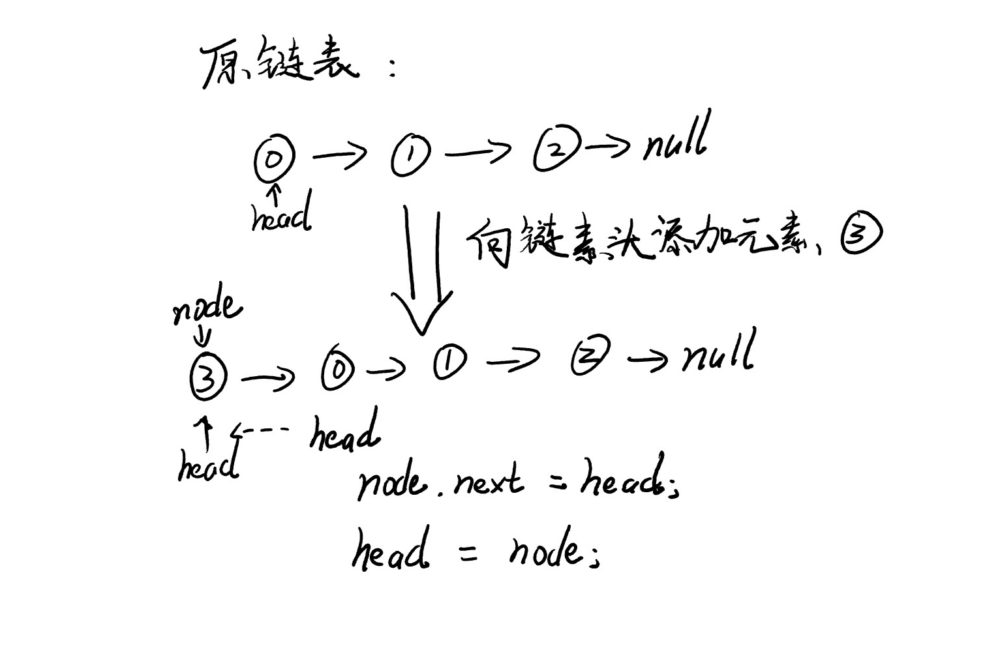

# 链表

## 定义
（维基百科）链表（Linked list）是一种常见的基础数据结构，是一种线性表，但是并不会按线性的顺序存储数据，而是在每一个节点里存到下一个节点的指针(Pointer)。由于不必须按顺序存储，链表在插入的时候可以达到O(1)的复杂度，比另一种线性表顺序表快得多，但是查找一个节点或者访问特定编号的节点则需要O(n)的时间，而顺序表相应的时间复杂度分别是O(logn)和O(1)。  

链表是最简单的动态数据结构，它是真正的动态数据结构。  

数据存储在“节点”（Node）中，可以把链表想象为一个火车，e为车厢，用来存储数据，next为连接火车车厢的链条，用来连接下一节车厢。  
```Java
class Node {
    E e;
    Node next;
}
```

## 优缺点
* 优点：真正的动态，不需要处理固定容量的问题
* 缺点：没有随机访问的能力，查找一个节点或者访问铁定编号的节点需要O(n)的时间

## 链表与数组的比较
* 链表不适用于索引有语义的情况，而数组比较适合索引有语义的情况，支持快速查询。
* 数组是静态数据结构，而链表是动态数据结构

## 设计节点内部类
Linked List是由一个个Node构成的，我们设计了一个内部类Node来表示节点。下面为代码的实现：
```java
// Inner class named node
private class Node {
    public E e;
    public Node next;

    public Node(E e, Node next) {
        this.e = e;
        this.next = next;
    }

    public Node(E e) {
        this(e, null);
    }

    public Node() {
        this(null, null);
    }

    @Override
    public String toString() {
        return e.toString();
    }
}
```

## 在链表中添加元素（不常用，不是链表所擅长）
LinkedList类中应该有一个Node类型的head，指向链表中的第一个节点。
```Java
private Node head;
private int size;
```

### LinkedList类构造函数
构造函数，给head赋值为null，给size赋值为0
```Java
public LinkedList() {
    head = null;
    size = 0;
}
```

### 获取链表中元素个数
直接返回size成员属性
```Java
public int getSize() {
    return size;
}
```

### 返回链表是否为空
```Java
public boolean isEmpty() {
    return size == 0;
}
```

### 在链表头添加元素
在链表头添加元素非常简单，实际上就是执行三步操作
1. 新建一个Node节点
2. 将新建的Node节点的next指针指向head节点
3. 将head指针移动到新建的Node节点上  
流程参考图示：


Java代码：
```Java
public void addFirst(E e) {
    head = new Node(e, head);
    size ++;
}
```

### 在链表中间添加元素
UPDATING ...
