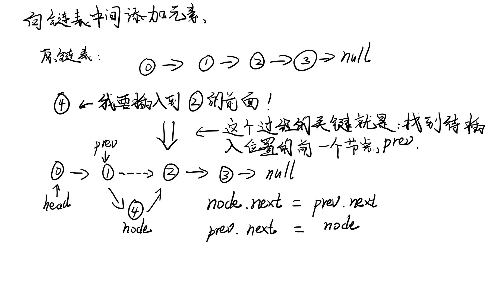

# 链表

## 定义
（维基百科）链表（Linked list）是一种常见的基础数据结构，是一种线性表，但是并不会按线性的顺序存储数据，而是在每一个结点里存到下一个结点的指针(Pointer)。由于不必须按顺序存储，链表在插入的时候可以达到O(1)的复杂度，比另一种线性表顺序表快得多，但是查找一个结点或者访问特定编号的结点则需要O(n)的时间，而顺序表相应的时间复杂度分别是O(logn)和O(1)。  

链表是最简单的动态数据结构，它是真正的动态数据结构。  

数据存储在“结点”（Node）中，可以把链表想象为一个火车，e为车厢，用来存储数据，next为连接火车车厢的链条，用来连接下一节车厢。  
```Java
class Node {
    E e;
    Node next;
}
```

## 优缺点
* 优点：真正的动态，不需要处理固定容量的问题
* 缺点：没有随机访问的能力，查找一个结点或者访问铁定编号的结点需要O(n)的时间

## 链表与数组的比较
* 链表不适用于索引有语义的情况，而数组比较适合索引有语义的情况，支持快速查询。
* 数组是静态数据结构，而链表是动态数据结构

## 设计结点内部类 Node
Linked List是由一个个Node构成的，我们设计了一个内部类Node来表示结点。下面为代码的实现：
```java
// Inner class named Node
private class Node {
    public E e;
    public Node next;

    public Node(E e, Node next) {
        this.e = e;
        this.next = next;
    }

    public Node(E e) {
        this(e, null);
    }

    public Node() {
        this(null, null);
    }

    @Override
    public String toString() {
        return e.toString();
    }
}
```

## 在链表中添加元素（不常用，不是链表所擅长）
LinkedList类中应该有一个Node类型的head，指向链表中的第一个结点。
```Java
private Node head;
private int size;
```

### LinkedList类构造函数
构造函数，给head赋值为null，给size赋值为0
```Java
public LinkedList() {
    head = null;
    size = 0;
}
```

### 获取链表中元素个数
直接返回size成员属性
```Java
public int getSize() {
    return size;
}
```

### 返回链表是否为空
```Java
public boolean isEmpty() {
    return size == 0;
}
```

### 在链表头添加元素
在链表头添加元素非常简单，实际上就是执行三步操作
1. 新建一个Node结点
2. 将新建的Node结点的next指针指向head结点
3. 将head指针移动到新建的Node结点上  

流程参考图示：


Java代码：
```Java
public void addFirst(E e) {
    head = new Node(e, head);
    size ++;
}
```

### 在链表中间添加元素
当我们想要在指定的位置插入结点，有以下几步操作
1. 创建一个新的Node结点
2. 找到插入Node结点后，Node结点前的结点`prev`，初始化指向head。关键的一部
3. 把prev的next指向待插入的Node，Node的next指向prev的next

流程参考图示：


注意：
1. 当在头部插入新元素，那么head是没有prev的，所以这种情况需要单独处理一下
2. node.next = prev.next;prev.next = node;步骤不能颠倒

下面我们看下下具体使用Java代码的实现：
```Java
/**
 * 在链表的index（0-based）位置添加新的元素e
 * @param index int 索引位置
 * @param e E 待添加的元素
 */
public void add(int index, E e) {
    if(index < 0 || index > size)
        throw new IllegalArgumentException("Add failed. Illegal index.");
    if(index == 0)
        this.addFirst(e);
    else {
        Node prev = head;
        for(int i=0; i<index-1; i++)
            prev = prev.next;
        
        prev.next = new Node(e, prev.next);

        size ++;
    }
}
```

### 为链表设立虚拟头结点
在上一小节中，我们在向链表头添加元素和向其他位置添加元素，逻辑上是有差别的。这是因为我们首先要找到待添加的位置之前的结点，而链表头没有前结点，所以需要一个判断分支来处理这个区别。
如何更优雅地添加元素呢？这里我们引入一个概念：dummyHead(虚拟头结点)

dummyHead是为了我们编写逻辑方便而出现的虚拟结点。这个结点是不存在，对于用户来说是屏蔽的。

图示：


Java代码变更：
```Java
// 首先，我们将构造函数的head改为dummyHead
public LinkedList() {
    dummyHead = new Node(null, null);
    size = 0;
}
// 有了dummy，修改add方法的逻辑
public void add(int index, E e) {
    if(index < 0 || index < size)
        throw new IllegalArgumentException("Add failed. Illegal index.");
    Node prev = dummyHead;
    for(int i=0; i<index; i++)
        prev = prev.next;
    prev.next = new Node(e, prev.next);
    size ++;
}
// 最后直接修改addFirst逻辑，调用add方法即可。
public void addFirst(E e) {
    this.add(0, e);
}
```

